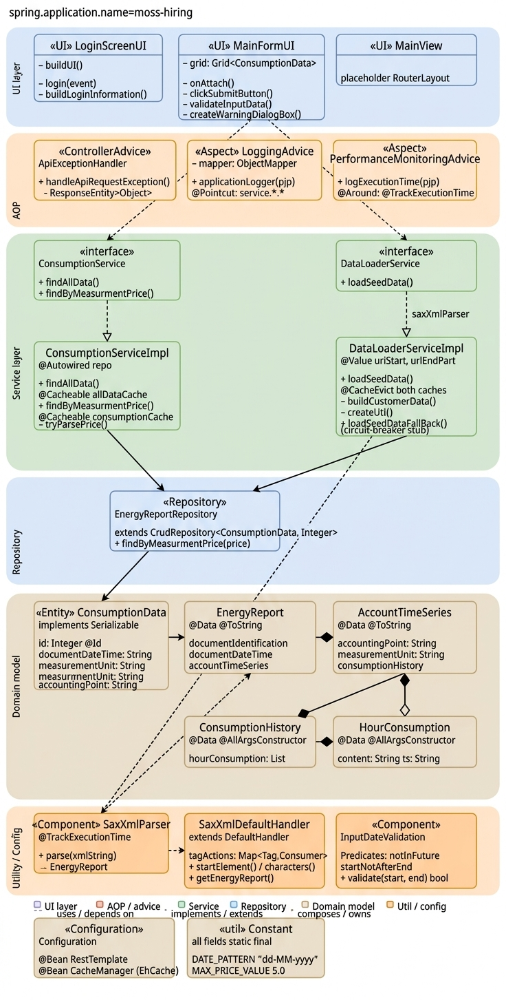

# kW/h Coding Assignment

> Built with **Java 8** · **Spring Boot** · **Vaadin Flow** · **H2** · **EhCache**

The purpose of this assignment is to create a web form which allows users to display and filter their electricity consumption history. It should also be possible to enter a kW/h price and use it to calculate the monetary value of energy consumption.

---

## Architecture — UML Class Diagram



<div align="center">

```
╔══════════════════════════════════════════════════════════════════════════════════╗
║  UI LAYER  (Vaadin Flow)                                                        ║
║                                                                                  ║
║  ┌─────────────────────┐   ┌───────────────────────────┐   ┌────────────────┐  ║
║  │  «UI»               │   │  «UI»                     │   │  «UI»          │  ║
║  │  LoginScreenUI      │   │  MainFormUI               │   │  MainView      │  ║
║  │─────────────────────│   │───────────────────────────│   │────────────────│  ║
║  │  @Route("Login")    │   │  @Route("Main")           │   │  @SpringComp   │  ║
║  │─────────────────────│   │───────────────────────────│   │  @UIScope      │  ║
║  │  buildUI()          │   │  grid: Grid<Consumption>  │   │                │  ║
║  │  login(event)       │   │  onAttach()               │   │  placeholder   │  ║
║  │  buildLoginInfo()   │   │  clickSubmitButton()      │   │  RouterLayout  │  ║
║  │                     │   │  validateInputDate()      │   │                │  ║
║  │                     │   │  createWarningDialogBox() │   │                │  ║
║  └─────────────────────┘   └───────────┬───────────────┘   └────────────────┘  ║
╚═══════════════════════════════════════ │ ═══════════════════════════════════════╝
                  uses (via constructor) │ uses
          ┌──────────────────────────────┴──────────────────────────┐
          ▼                                                          ▼
╔══════════════════════════════╗                    ╔════════════════════════════════╗
║  SERVICE LAYER               ║                    ║  SERVICE LAYER                 ║
║                              ║                    ║                                ║
║  «interface»                 ║                    ║  «interface»                   ║
║  ConsumptionService          ║                    ║  DataLoaderService             ║
║  ──────────────────────────  ║                    ║  ──────────────────────────    ║
║  + findAllData()             ║                    ║  + loadSeedData()              ║
║  + findByMeasurmentPrice()   ║                    ║                                ║
║                              ║                    ║                                ║
║         implements ▲         ║                    ║        implements ▲             ║
║                    │         ║                    ║                   │             ║
║  ConsumptionServiceImpl      ║                    ║  DataLoaderServiceImpl         ║
║  ──────────────────────────  ║                    ║  ──────────────────────────    ║
║  @Autowired repo             ║                    ║  @Autowired parser, repo       ║
║  ──────────────────────────  ║                    ║  @Value urlStart, urlEndPart   ║
║  + findAllData()             ║                    ║  ──────────────────────────    ║
║    @Cacheable allDataCache   ║                    ║  + loadSeedData()              ║
║  + findByMeasurmentPrice()   ║                    ║    @CacheEvict both caches     ║
║    @Cacheable consumptionC.  ║                    ║  – buildCustomerData()         ║
║  – tryParsePrice() Optional  ║                    ║  – createUrl()                 ║
║                              ║                    ║  + loadSeedDataFallBack()      ║
╚══════════════╤═══════════════╝                    ╚═══════════╤════════════════════╝
               │ @Autowired                                     │ @Autowired
               └────────────────────┬───────────────────────────┘
                                    ▼
╔═══════════════════════════════════════════════════════════════════════════════════╗
║  REPOSITORY LAYER                                                                 ║
║                                                                                   ║
║  ┌──────────────────────────────────────────────────────┐                        ║
║  │  «Repository»  EnergyReportRepository                 │                        ║
║  │  ─────────────────────────────────────────────────── │                        ║
║  │  extends CrudRepository<ConsumptionData, Integer>     │                        ║
║  │  + findByMeasurmentPrice(price): List<ConsumptionData>│                        ║
║  └───────────────────────────┬──────────────────────────┘                        ║
╚═══════════════════════════════│═══════════════════════════════════════════════════╝
                                │ manages @Entity
                                ▼
╔═══════════════════════════════════════════════════════════════════════════════════╗
║  DOMAIN MODEL LAYER                                                               ║
║                                                                                   ║
║  ┌────────────────────────┐   ┌────────────────────────┐                         ║
║  │  «Entity»              │   │  EnergyReport          │                         ║
║  │  ConsumptionData       │   │  ──────────────────── │                         ║
║  │  ──────────────────── │   │  @Data @ToString       │                         ║
║  │  implements Serializable│   │  ──────────────────── │                         ║
║  │  ──────────────────── │   │  documentIdentification│──────────┐              ║
║  │  id: Integer @Id       │   │  documentDateTime      │          │              ║
║  │  documentDateTime      │   │  accountTimeSeries ────┼──────►  │              ║
║  │  measurementUnit       │   └────────────────────────┘          ▼              ║
║  │  measurmentPrice       │                              ┌──────────────────────┐ ║
║  │  accountingPoint       │                              │  AccountTimeSeries   │ ║
║  └────────────────────────┘                              │  ──────────────────  │ ║
║                                                          │  accountingPoint     │ ║
║                                                          │  measurementUnit     │ ║
║                                                          │  consumptionHistory──┼─►┐
║                                                          └──────────────────────┘ ║ │
║                                                    ┌────────────────────────────┐ ║ │
║                                               ◄────┤  ConsumptionHistory        │◄┘║
║                                                    │  ──────────────────────    │  ║
║                                                    │  hourConsumption: List──►  │  ║
║                                                    └────────────────────────────┘  ║
║                                                    ┌───────────────────────────────║─┐
║                                                    │  HourConsumption              ║ │
║                                               ◄───│  ──────────────────────       ║ │
║                                                    │  content: String              ║ │
║                                                    │  ts: String                   ║ │
║                                                    └───────────────────────────────║─┘
╚═══════════════════════════════════════════════════════════════════════════════════╝

╔═══════════════════════════════════════════════════════════════════════════════════╗
║  AOP / CROSS-CUTTING CONCERNS                                                     ║
║                                                                                   ║
║  ┌────────────────────────────┐  ┌───────────────────────┐  ┌────────────────┐  ║
║  │  «ControllerAdvice»        │  │  «Aspect»             │  │  «Aspect»      │  ║
║  │  ApiExceptionHandler       │  │  LoggingAdvice        │  │  Performance   │  ║
║  │  ────────────────────────  │  │  ─────────────────── │  │  Monitoring    │  ║
║  │  @ExceptionHandler         │  │  @Pointcut service.*  │  │  Advice        │  ║
║  │  handleApiRequestException │  │  applicationLogger()  │  │  ──────────── │  ║
║  │  → ResponseEntity<Object>  │  │  mapper: ObjectMapper │  │  @Around       │  ║
║  └────────────────────────────┘  └───────────────────────┘  │  @TrackExec.   │  ║
║                                                               └────────────────┘  ║
╚═══════════════════════════════════════════════════════════════════════════════════╝

╔═══════════════════════════════════════════════════════════════════════════════════╗
║  UTILITY & CONFIGURATION                                                          ║
║                                                                                   ║
║  ┌───────────────────────┐  ┌─────────────────────────┐  ┌───────────────────┐  ║
║  │  «Component»          │  │  SaxXmlDefaultHandler   │  │  «Component»      │  ║
║  │  SaxXmlParser         │  │  ──────────────────────  │  │  InputDate        │  ║
║  │  ─────────────────── │  │  extends DefaultHandler  │  │  Validation       │  ║
║  │  @TrackExecutionTime  │  │  tagActions:             │  │  ─────────────── │  ║
║  │  + parse(xmlString)   │──►  Map<Tag,BiConsumer>    │  │  Predicate chain  │  ║
║  │  → EnergyReport       │  │  + startElement()        │  │  + validate()     │  ║
║  └───────────────────────┘  │  + characters()          │  │  notInFuture      │  ║
║                              │  + getEnergyReport()     │  │  startNotAfterEnd │  ║
║                              └─────────────────────────┘  └───────────────────┘  ║
║                                                                                   ║
║  ┌──────────────────────────────────┐   ┌────────────────────────────────────┐  ║
║  │  «Configuration»                 │   │  «util» Constant                   │  ║
║  │  Configuration                   │   │  ──────────────────────────────── │  ║
║  │  ────────────────────────────── │   │  DATE_PATTERN  "dd-MM-yyyy"        │  ║
║  │  @Bean RestTemplate              │   │  MAX_PRICE_VALUE  5.0              │  ║
║  │  @Bean CacheManager (EhCache)    │   │  MIN_PRICE_VALUE  0.0              │  ║
║  │  @Bean EhCacheManagerFactoryBean │   │  DAYS_TO_SUBTRACT  730             │  ║
║  └──────────────────────────────────┘   └────────────────────────────────────┘  ║
╚═══════════════════════════════════════════════════════════════════════════════════╝
```

**Relationship key:** `▲` implements interface · `──►` composes / owns · `@Autowired` dependency injection

</div>

---

## Requirements

An Object Oriented approach should be used — the stated problem can be easily solved procedurally, but the main goal of this exercise is to assess development ability and knowledge. It is highly recommended to use more classes and data structures than strictly necessary to deliver a functioning solution.

- It is permitted but not mandatory to use a well known framework — server side and client side
- The solution should look aesthetic and presentable
- On the form it should be possible to select a date range for which to show consumption history — it should only be possible to select values for which there is data present (up to two years in the past)
- On the form it should be possible to select a period by which the data is grouped (days, weeks, months)
- The form should include a field to enter the kW/h price; upon entry the value should be used on the front-end to supplement each consumption history row with its monetary value
- The download and aggregation of data should be done on the server side
- The results must be cached so as not to repeat the same queries
- The results are sent to the front-end in structural format using AJAX; calculations (excluding the initial data aggregation) must not trigger server calls
- The data is presented to the user in a table according to the selected filters (charts are not forbidden)
- All error situations should be handled and the user should be shown adequate error messages

---

## Consumption Feed

The feed is accessible at:

```
http://finestmedia.ee/kwh/?start={start}&end={end}
```

| Parameter | Format       | Description                                          |
|-----------|--------------|------------------------------------------------------|
| `start`   | `dd-mm-yyyy` | Start date from which consumption data is returned   |
| `end`     | `dd-mm-yyyy` | End date until which consumption data is returned    |

**Notes:**
- The feed is "broken" and always returns data for a longer period than requested
- The response format is always XML
- Consumption history can be queried up to **two years** in the past
- Data is presented as **hourly** readings

---

## Assumptions & Design Decisions

| # | Decision |
|---|----------|
| 1 | Maximum kW/h price value is **5.0**; price can never be negative |
| 2 | Currently there is no authentication — noted as a future improvement |
| 3 | **H2** in-memory database is used to store the parsed XML seed data |
| 4 | **EhCache** with two regions: `allDataCache` (full dataset) and `consumptionCache` (filtered by date/price) |
| 5 | **`@CacheEvict`** on both regions fires whenever `loadSeedData()` succeeds, preventing stale reads |
| 6 | **Vaadin Flow** used for rapid UI development |
| 7 | **SAX parser** chosen over DOM to avoid loading the full XML into memory |
| 8 | **Java 8 features** used throughout: `Optional` pipelines, `Stream` + `filter`/`collect`, `Predicate` composition, `EnumMap` dispatch tables, `String.join()` |
| 9 | Unit tests use `MockitoJUnitRunner` (no Spring context) with `@InjectMocks` on the real implementation |

---

## Login

Default credentials (development only — replace with Spring Security before production):

| Username | Password |
|----------|----------|
| `john`   | `john`   |
